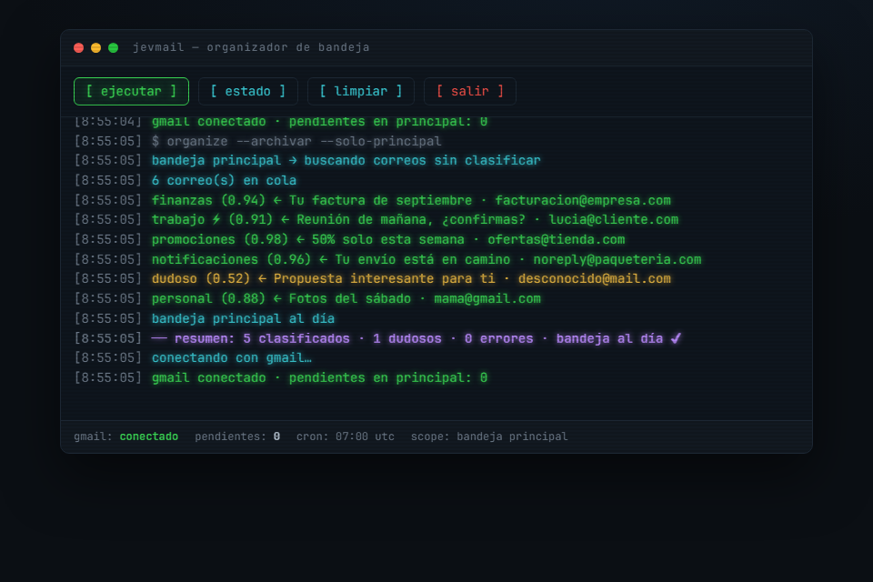
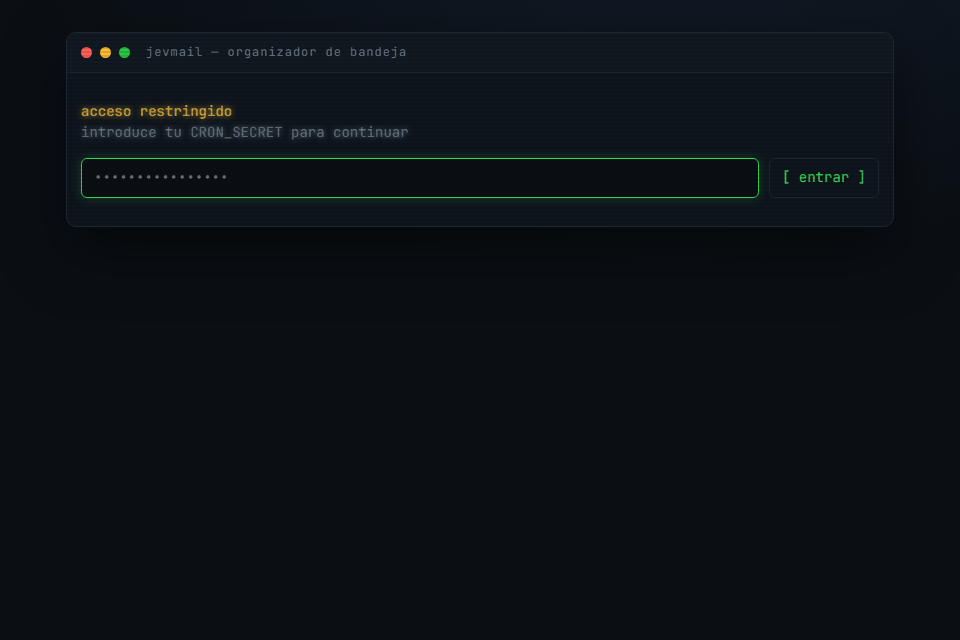

# JevMail

Mi bandeja principal de Gmail era un desastre, asi que hice esto. Todos los dias a las 7:00 un cron en Vercel lee los correos de la pestaña Principal, los clasifica con la IA JEV de TypeSafe, les pone su etiqueta y los archiva. Lo que la IA no tiene claro se va a la etiqueta `dudoso` y lo reviso yo.

Solo toco la pestaña Principal porque Social, Promociones y las demas ya las ordena Gmail.



La web estilo terminal la hice para la demo y para lanzarlo a mano cuando quiero, pero en el dia a dia todo corre solo con el cron.

## Que hace

- Clasifica en `trabajo`, `finanzas`, `personal`, `promociones`, `notificaciones`, `seguridad` y `otro`
- Marca `⚡ urgente` solo lo que escribio una persona y hay que atender hoy
- Si la confianza es menor a 0.6 lo manda a `dudoso`
- Archiva todo lo que procesa, asi la bandeja queda limpia

## Lo que necesitas

- Node 20+ y pnpm
- Una cuenta de Google Cloud (gratis)
- Una API key de TypeSafe
- Una cuenta de Vercel (el plan Hobby alcanza)

## Instalacion

### 1. Clonar

```bash
git clone https://github.com/<tu-usuario>/<tu-repo>.git
cd <tu-repo>
pnpm install
cp .env.example .env.local
```

### 2. Google Cloud

1. Crea un proyecto en [console.cloud.google.com](https://console.cloud.google.com) y activa la **Gmail API**
2. Configura la pantalla de consentimiento OAuth (tipo Externo) y agregate como usuario de prueba
3. Crea una credencial **ID de cliente OAuth** de tipo **App de escritorio**
4. Copia el client id y el secret en `GMAIL_CLIENT_ID` y `GMAIL_CLIENT_SECRET`

> Publica la app con el boton **Publish app**. Si la dejas en modo pruebas el token se vence cada 7 dias y te sale `invalid_grant`. A mi me paso.

### 3. Token de Gmail

```bash
pnpm get-gmail-token
```

Abre el link, acepta los permisos y cuando te mande a `localhost:3000` (va a dar error, es normal) copia la URL completa y pegala en la terminal. Te devuelve el `GMAIL_REFRESH_TOKEN`.

Solo pide permiso para leer, etiquetar y archivar. No puede borrar ni enviar correos.

### 4. TypeSafe y CRON_SECRET

Pon tu API key en `TYPESAFE_API_KEY`. Si ves algo tipo `ts-xxxx` eso es un placeholder, no la clave real. Yo perdi un buen rato con eso.

Para el `CRON_SECRET` genera uno random:

```bash
node -e "console.log(require('crypto').randomBytes(32).toString('hex'))"
```

### 5. Probar en local

```bash
pnpm dev
```

Entra a http://localhost:3000, pon tu `CRON_SECRET` y dale a **ejecutar**.



Si tienes muchos correos la primera vez te va a tocar ejecutarlo varias veces, cada corrida trabaja unos 50 segundos. Si sale lo de la cuota de Gmail solo espera un minuto y dale otra vez.

### 6. Subirlo a Vercel

1. Importa el repo en Vercel
2. En **Settings → Environment Variables** agrega las 5 variables de tu `.env.local`
3. Haz **Redeploy**, las variables nuevas no aplican hasta que vuelves a desplegar (esto me dio 401 la primera vez)

El cron ya esta en `vercel.json` a las 7:00 UTC. Ojo que es UTC, no tu hora local.

## Si algo falla

| Error | Que hacer |
|---|---|
| `401` en el cron o la web | Revisa el `CRON_SECRET` en Vercel y haz redeploy |
| `invalid_grant` | Publica la app en Google Cloud y saca otro token |
| `401` de TypeSafe | La API key esta mal o es el placeholder |
| `Quota exceeded` | Espera un minuto y vuelve a ejecutar |

## Licencia

[MIT](LICENSE)
